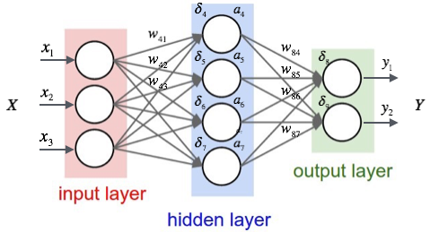

# Customizable Neural Network from Scratch

<div style="text-align: center;"">
  
</div>


<br>

- Implemented the Neural Network from Scratch using Numpy only.
- This implementation is also supported batch wise training

<br>

## Neural Net Component


### 1. Layers

- Structure:
    - The layer contains weights and biases, both implemented as NumPy matrices.
    - Weight Matrix Dimensions: [num_inputs x num_neurons]
    - Bias Matrix Dimensions: [num_neurons]

- Methods:
    - Forward Pass
        - Computes the forward operation as W<sup>T</sup> · X + B where 𝑊 is the weight matrix, 𝑋 is the input, and  𝐵 is the bias.

    - Backward Pass
        - Calculates partial derivatives of the loss function with respect to weights, biases, and inputs, following standard backpropagation with regularization.
        - we need to calculate the loss w.r.t to inputs because current layer input is output of previous layer 

<br>

### 2. Activation Function

- Activation functions introduce non-linearity, enabling neural networks to learn complex patterns and represent intricate relationships in data.
- Each activation function contain the 2 methos forward pass and backward pass.

- Functions:

    - ReLu function:
        - Forward pass:  ReLu(x) = max(0, x)
        - Backward pass:  derivate of ReLu = 1 if x > 0 else 0
    
    - Crossentropy function:
        - Softmax function is crucial for multiclass classification tasks, as it converts raw model outputs (logits) into probabilities that sum to one, making them interpretable as likelihoods for each class.
        - Forward pass: softmax(z)_i = exp(z_i) / Σ exp(z_j)

            where:
            - softmax(z)_i is the probability for class i,
            - z_i is the logit for class i, and
            - Σ exp(z_j) is the sum of the exponentials of all logits, which normalizes the probabilities to sum to 1.


<br>


### 3. Loss

- Methods

    - regularization_loss 

        - Computes the regularization loss for a given layer based on L1 and L2 regularization terms.
        - Returns the total regularization loss for the layer by summing up these components.

        - L1 Regularization: Adds a penalty proportional to the absolute values of the layer’s weights and biases if weight_regularizer_l1 or bias_regularizer_l1 is set, respectively. This tends to encourage sparsity.
        - L2 Regularization: Adds a penalty proportional to the square of the layer’s weights and biases if weight_regularizer_l2 or bias_regularizer_l2 is set. This discourages large weights and biases, which can help in avoiding overfitting.

    - Calculate:
        - Data Loss: Calls self.forward(output, y) (to be implemented in a derived class) to compute the sample losses, then takes the mean as the data loss.


<br>


### 4. Loss_CategoricalCrossentropy

- Implements the categorical cross-entropy loss function, commonly used for classification problems where the output is a probability distribution over multiple classes. It computes the loss between the predicted probabilities (y_pred) and the true labels (y_true), either as integer-encoded labels or one-hot encoded vectors.

- Methods:

    - forward pass

        - Computes the categorical cross-entropy loss for each sample in the batch.
        
        - Clip Predicted Probabilities: Clips the predicted probabilities (y_pred) between a small value (config.output_clip) and 1 - config.output_clip to prevent log(0) which would cause division errors.

        - Calculate Correct Confidences:
            - If y_true is a vector of integers (i.e., integer-encoded labels), selects the predicted confidence corresponding to the true class index.
            - If y_true is one-hot encoded, calculates the sum of the product of predicted probabilities and the one-hot encoded true labels for each sample.
        - Compute Negative Log-Likelihood: Applies the negative log to the correct confidences to compute the individual losses for each sample.
        
    - backward pass
        - Computes the gradients of the loss function with respect to the predicted values (dinputs), which will be used in backpropagation to adjust model parameters.
        
        - Handle Integer Labels: If y_true is integer-encoded, it converts it to a one-hot encoded format for gradient computation.
        - Calculate Gradients: Computes the gradient of the loss with respect to the predicted values (dvalues) using the derivative of the categorical cross-entropy function, which is the negative of the true labels divided by the predicted values.
        - Normalize Gradients: Normalizes the gradients by dividing by the number of samples (samples).
        - The method updates self.dinputs with the computed gradients, which will be propagated backward in the network.

<br>

### 5. Activation_Softmax_Loss_CategoricalCrossentropy 

- Combines the Softmax activation and Categorical Cross-Entropy loss into a single class, commonly used for multi-class classification tasks.
- Methods:

    - Forward Pass:
        - Computes the forward pass by applying the Softmax activation to the inputs and then calculating the Categorical Cross-Entropy loss between the predicted probabilities and true labels.
        - Applies the Softmax activation function to the inputs.

        - Calculates the loss using Categorical Cross-Entropy between the output probabilities and the true labels.

    - Backward Pass:
        - Computes the gradients of the loss with respect to the inputs (used for backpropagation).
        - If y_true is one-hot encoded, it is converted to integer labels by taking the argmax.
        - Computes the gradient of the loss with respect to the predicted values (dinputs), by adjusting the predicted probabilities for the true class.

        - Normalizes the gradients by dividing by the number of samples.


<br>


### 6. Optimizer_SGD_with_Momentum 

- The Stochastic Gradient Descent (SGD) optimization algorithm with momentum. It updates the model's parameters (weights and biases) during training to minimize the loss function.

- Key Parameters :
    
    - learning_rate: The rate at which the model parameters are updated.

    - decay: A factor for learning rate decay over time.
    - momentum: The momentum factor to accelerate convergence by adding a fraction of previous updates.

- Flow :
    - Updates the learning rate if decay is applied.
    - Updates the model's weights and biases using either:

        - Momentum: Adjusts updates by incorporating previous updates (stored in weight_momentums and bias_momentums).
        
        - Vanilla SGD: Directly updates parameters without momentum.
    - If momentum is used, the weight and bias momentums are updated and applied to the gradients.
    
    - Increments the iteration counter after each parameter update.

- Usage :

    - Useful for training neural networks, offering an option to incorporate momentum for faster convergence and preventing oscillations during optimization.

<br>

### 7. Optimizer_Adagrad
    
- Adagrad optimization algorithm, which adapts the learning rate for each parameter individually based on its historical gradient information.

- Key Parameters:
    
    - learning_rate: The base learning rate used for parameter updates.
    
    - decay: A factor for learning rate decay over time.
    - epsilon: A small constant to prevent division by zero when normalizing gradients.
    
- Flow :

    - Updates the learning rate if decay is applied.
    - Updates the weights and biases using Adagrad, adjusting the learning rate for each parameter based on the squared sum of its gradients (stored in weight_cache and bias_cache).
    - Gradients are normalized with the square root of the accumulated cache, ensuring that frequently updated parameters receive smaller updates over time.
    - Increments the iteration counter after each parameter update.

- Usage :

    - Useful for problems with sparse gradients, where parameters that frequently update get smaller learning rates, making the algorithm well-suited for handling features with varying scales.

<br>

### 8. Optimizer_RMSprop
    
- RMSprop optimization algorithm, which adapts the learning rate based on the moving average of squared gradients, helping to stabilize updates for each parameter.

- Key Parameters:

    - learning_rate: The base learning rate for updates.

    - decay: Learning rate decay factor over time.
    - epsilon: Small constant to avoid division by zero when normalizing gradients.
    - rho: The smoothing constant that controls the moving average of squared gradients.

- Flow:

    - Updates the learning rate if decay is applied.

    - Applies RMSprop by updating the parameter caches (weight_cache and bias_cache) with a moving average of squared gradients.
    - The parameter updates are then normalized by the square root of these caches and adjusted by the learning rate.
    - Increments the iteration counter after each parameter update.

- Usage:

    - RMSprop is well-suited for problems with non-stationary objectives, offering a balance between the momentum of past gradients and smoothing to avoid drastic updates. It is particularly effective in deep learning scenarios with noisy gradients.

<br>


### 9. Optimizer_Adam 

- The Optimizer_Adam class implements the Adam (Adaptive Moment Estimation) optimization algorithm, combining the benefits of both momentum (for faster convergence) and RMSprop (for adaptive learning rates).

- Key Parameters:

    - learning_rate: The base learning rate for updates.

    - decay: Learning rate decay factor over time.
    - epsilon: Small constant to avoid division by zero when normalizing gradients.
    - beta_1: The exponential decay rate for the first moment estimate (momentum).
    - beta_2: The exponential decay rate for the second moment estimate (uncentered variance).
    
- Flow

    - Adjusts the learning rate if decay is applied.
    
    - Updates momentum and cache estimates using exponential moving averages of gradients and squared gradients.
    - Corrects for bias in momentum and cache estimates in the initial iterations.
    - Applies the Adam update rule to adjust weights and biases using corrected momentum and cache values.
    - Increments the iteration counter after each parameter update.

- Usage:
    - Adam is widely used for its adaptive learning rate mechanism and efficiency in handling sparse gradients, making it particularly effective for training deep neural networks and handling noisy data. It is often the optimizer of choice for many types of machine learning models.

<br>

### 10 Dropout

- Dropout is a regularization technique used to prevent overfitting in neural networks by randomly deactivating a subset of neurons during each forward pass, encouraging the network to learn more robust features.

- Methods:
    - Forward Pass
        - Stores the inputs for use in backpropagation.
        - Generates a binary_mask using a binomial distribution that keeps each neuron active with probability dropout rate, then scales the mask.
        - Applies this mask to the inputs to produce the dropout-adjusted output.

    - Backward Pass
        - Multiplies gradients from the next layer with binary_mask to propagate gradients only through active neurons.


<br>

## File Structure 
- `config.py`      → Contains all parameter values and constants for the neural network.

- `loss.py`        → Contains functions for loss calculation with regularization and backpropagation.
- `main.py`        → Defines the architecture of the neural network, including training, testing, and optimizer selection.
- `Utils.py`       → Contains the activation functions, dropout, and layer definitions.
- `Optimizer.py`   → Implements various optimizer algorithms.
- `Experiment/`       → Contains experiments and results using the NNFS spiral dataset.

<br>


## Usage

```python
    python main.py
```

- For changing the hyperparameter or constants  do change in   `config.py`      
- For Changing the datset and Defining the Artictecture or Artictecture do chaneg in  `main.py`   

<br>

## Experiments

- This Neural Net implementation is tried on nnfs spiral Dataset


### Artictecture
- Input Layer :- (2,64)
- first Hidden Layer :- (64,3)

### Hyperparameter
- number of classes :- 3
- l2 weight regularizer :- 5e-4
- l2 bias regularizer :- 5e-4
- learning_rate=0.05
- decay :- 5e-5
- epsilon :- 1e-7
- epochs :-  10000
- log_step :-  100
- dropout_rate :- 0.1


### Results 
-  Accuracy :- 71 %

<br>

## Libraries

```code
    pip install numpy nnfs matplotlib seaborn scikit-learn
```

- `Numpy`        → Used for the entire neural network implementation.

- `nnfs`         → Used for the spiral dataset generation.
- `matplotlib` / `seaborn` → Used for visualization and plotting purposes.
- `sklearn`      → Used for generating confusion matrix and classification report.


<br>


## Reference
- Book "Neaural Net From Scratch" By Harrison Kinsley and Daniel Kukieła